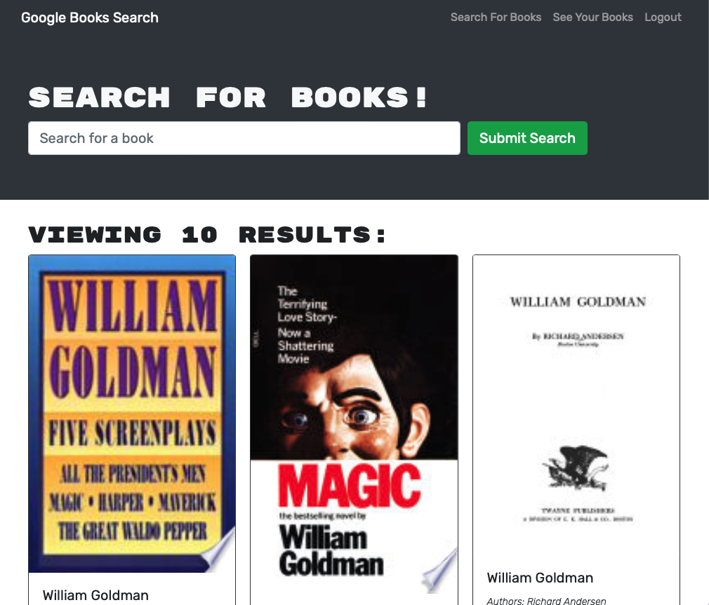

# Book Search 

## Description

Book Search is a simple application that enables the user to search book titles using the Google Books API, and save titles to a list for their own purposes, such as a list of titles to read or a reading diary.

This application exists to do this simple thing in an easy way. It has been refactored to run on the graphQL technology.

## Table of Contents

- [Installation Instructions](#installation-instructions)
- [Usage Information](#usage-information)
- [Credits](#credits)
- [Software License](#software-license)
- [Contact the Developer](#contact-the-developer)

## Installation Instructions

To interact with the application as a user, no installation is necessary, just a web browser. Javascript must be enabled.

To run a version of the application yourself, you must have Node.js deployed (the app was coded on version 18.15). From the root directory, run an `npm install` to create both the front end and the back end. Run the client and server indiependently with either `npm run build` or `npm run start`; run both in development mode in `npm run develop`.

## Usage Information

Users can use Book Search by creating an account or logging into an existing account, searching for books, adding some to their list, and viewing their list.

Sign up for an account by clicking "Login/Sign Up", and then choosing the "Sign Up" tab. Create an account with a unique username and email address by filling out the form and clicking "Submit". If the user already has an acount, they can log in instead by choosing the "Login" tab, providing email and password credentials, and clicking "Submit".

Once logged in, search for book titles on the "Search for Books" page (accessible from the navigation in the upper right) by typing in a title to search for and clicking "Submit Search". Search results include an image of the book's cover, the author(s), and a description of the book. The user may save any of the search results to their list by clicking the "Save this Book!" button (the button is disabled with an indication that the book is already on the user's list if such is the case).

To view their list, the user may navigate to the "See Your Books" page by way of the navigation in the upper right. There they will find a list of all the books they have saved, with similar information as in search results. Each will have a "Delete this Book!" button. Clicking that will only remove it from their saved books list, not erase it from history.

The user may log out at any time using the "Logout" link in the navigation in the upper right.

## Credits

Book Search was provided in its full functionality by the staff of the [University of Minnesota Full Stack Coding Boot Camp](https://bootcamp.umn.edu/coding/). Conversion to graphQL technology by Lee Klusky, with an immense amount of help from the staff and fellow students of that program. Guidance and wisdom from the developers of [Apollo Server](https://www.apollographql.com/docs/apollo-server/), [graphQL](https://graphql.org) and [React.js](https://react.dev), as well as places like [Stack Overflow](https://www.stackoverflow.com).

## Software License

©2023, Lee Klusky

This software is covered by a [MIT License](https://opensource.org/licenses/MIT).

Permission is hereby granted, free of charge, to any person obtaining a copy of this software and associated documentation files (the "Software"), to deal in the Software without restriction, including without limitation the rights to use, copy, modify, merge, publish, distribute, sublicense, and/or sell copies of the Software, and to permit persons to whom the Software is furnished to do so, subject to the following conditions:

The above copyright notice and this permission notice shall be included in all copies or substantial portions of the Software.

THE SOFTWARE IS PROVIDED "AS IS", WITHOUT WARRANTY OF ANY KIND, EXPRESS OR IMPLIED, INCLUDING BUT NOT LIMITED TO THE WARRANTIES OF MERCHANTABILITY, FITNESS FOR A PARTICULAR PURPOSE AND NONINFRINGEMENT. IN NO EVENT SHALL THE AUTHORS OR COPYRIGHT HOLDERS BE LIABLE FOR ANY CLAIM, DAMAGES OR OTHER LIABILITY, WHETHER IN AN ACTION OF CONTRACT, TORT OR OTHERWISE, ARISING FROM, OUT OF OR IN CONNECTION WITH THE SOFTWARE OR THE USE OR OTHER DEALINGS IN THE SOFTWARE.

## Questions?

Contact me at <a href="mailto:lkbootcamp@yahoo.com">lkbootcamp@yahoo.com</a>, or visit my [GitHub profile](https://www.github.com/lkalliance).
